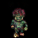
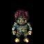

# TranSVAE

| Source (Original) | Target (Original) | 
| :-: | :-: |
|  |  |
| |
| Reconstruction ($\mathbf{z}_d^{\mathcal{S}}$ + $\mathbf{z}_t^{\mathcal{S}}$) | Reconstruction ($\mathbf{z}_d^{\mathcal{T}}$ + $\mathbf{z}_t^{\mathcal{T}}$) | 
|  |  |
| |
| Reconstruction ($\mathbf{z}_d^{\mathcal{S}} + \mathbf{0}$) | Reconstruction ($\mathbf{z}_d^{\mathcal{T}} + \mathbf{0}$) | 
|  |  |
| |
| Reconstruction ($\mathbf{0} + \mathbf{z}_t^{\mathcal{S}}$) | Reconstruction ($\mathbf{0} + \mathbf{z}_t^{\mathcal{T}}$) | 
|  |  |
| |
| Reconstruction ($\mathbf{z}_d^{\mathcal{S}} + \mathbf{z}_t^{\mathcal{T}}$) | Reconstruction ($\mathbf{z}_d^{\mathcal{T}} + \mathbf{z}_t^{\mathcal{S}}$) | 
|  |  |
